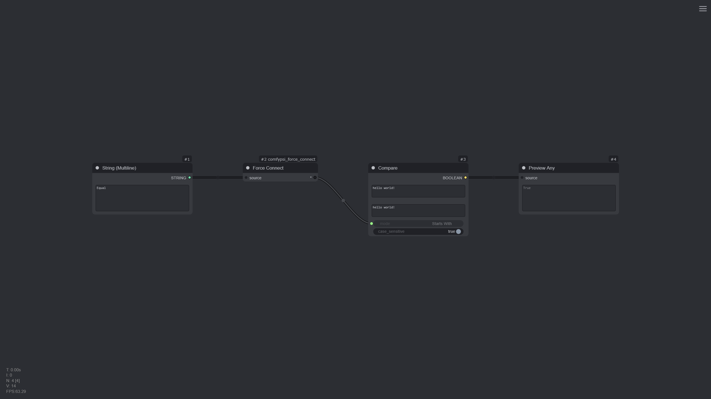

# Force Connect

A custom node for ComfyUI that forces a connection between any input and output.

## Installation

There are two ways to install this custom node:

### ComfyUI Manager (Recommended)

1.  Install [ComfyUI Manager](https://github.com/ltdrdata/ComfyUI-Manager) if you don't have it yet.
2.  Go to `Manager` > `Install Custom Nodes`.
3.  Search for `Force Connect` and click `Install`.
4.  Restart ComfyUI.

### Manual

1.  Navigate to your `ComfyUI/custom_nodes/` directory.
2.  Clone the repository: `git clone https://github.com/rookiepsi/comfypsi_force_connect.git`.
3.  Restart ComfyUI.

## Usage

For detailed explanation, please refer to the [docs](web/docs/comfypsi_force_connect.md).

## Contributing

Contributions are welcome! Please feel free to submit a Pull Request. If you have an idea or find a bug, please create an issue using the templates.

## Development

1.  Look for an issue to work on or create a new one.
2.  Wait for approval.
3.  Fork this repository.
4.  Create a new branch `feature/[feature-name]` or `bug/[bug-name]`.
5.  Make your changes.
6.  Test your changes thoroughly.
7.  Create a Pull Request.
8.  Become a legend.

## License

This project is licensed under the [GNU GPLv3](LICENSE) license.

## Legends (Contributors)

- [@rookiepsi](https://github.com/rookiepsi)
